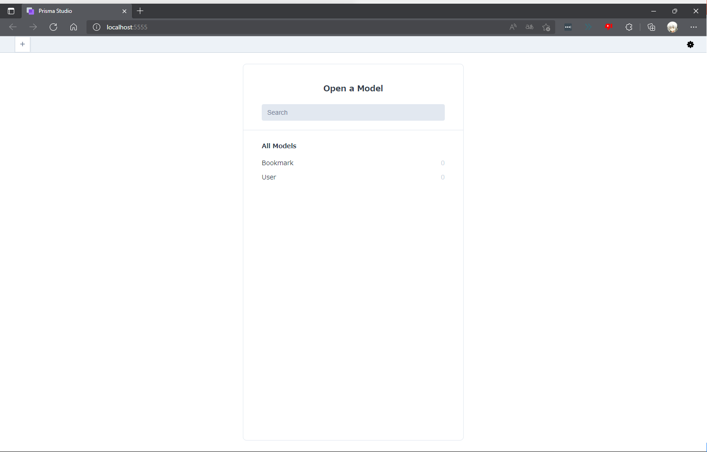

# Nest-Tutorial

NodeのフレームワークNestで簡単なWebアプリを開発してみた(**ちなみにNest自体はバックエンド開発で使われる。Nodeのフレームワークなので、フロントエンド開発では使えないのでその点に関してはご用心**)

# 実行

```
$ npm run start:dev
```

# コード

`src/main.ts`：Nestアプリのインスタンスを作成するための中核ファイル

```ts
// 開発者サーバを立ち上げる
import { NestFactory } from '@nestjs/core';
import { AppModule } from './app.module';

async function bootstrap() {
  const app = await NestFactory.create(AppModule);
  await app.listen(3000);
}
bootstrap();
```

`src/app.service.ts`：Nestアプリのサービスを担う

```ts
// ブラウザ上にHello Worldを表示させる
import { Injectable } from '@nestjs/common';

// ブラウザに文字を表示させる関数
@Injectable()
export class AppService {
  getHello(): string {
    return 'Hello World!';
  }
}
```

`src/app.module.ts`：Nestアプリのモジュール管理

```ts
// モジュール管理
import { Module } from '@nestjs/common';
import { AppController } from './app.controller';
import { AppService } from './app.service';

@Module({
  imports: [],
  controllers: [AppController],
  providers: [AppService],
})
export class AppModule {}
```

`src/app.controller.spec.ts`：Nestアプリのユニットテスト(`unittest`)を行う

```ts
// アプリケーション実行環境の管理
import { Test, TestingModule } from '@nestjs/testing';
import { AppController } from './app.controller';
import { AppService } from './app.service';

describe('AppController', () => {
  let appController: AppController;

  beforeEach(async () => {
    const app: TestingModule = await Test.createTestingModule({
      controllers: [AppController],
      providers: [AppService],
    }).compile();

    appController = app.get<AppController>(AppController);
  });

  describe('root', () => {
    it('should return "Hello World!"', () => {
      expect(appController.getHello()).toBe('Hello World!');
    });
  });
});
```

# セットアップ

まずは、`src`フォルダの中にあるファイルを以下の２つにする。それ以外のファイルはすべて削除。

```
app.module.ts
main.ts
```

`src/app.module.ts`

```ts
import { Module } from '@nestjs/common';

@Module({
  imports: [],
})
export class AppModule {}
```

# モジュール設定

## 手動でモジュールを設定する

`src/auth/auth.module.ts`(手動で作成)

```ts
import { Module } from "@nestjs/common";

@Module({
  imports: [],
})
export class AuthModule {}
```

ファイルを作成したあと、`src/app.module.ts`にアクセスしてプログラムを編集する

```ts
import { Module } from '@nestjs/common';
import { AuthModule } from './auth/auth.module';

@Module({
  imports: [AuthModule],
})

export class AppModule {}
```

## 自動でモジュールを生成

上記の設定は自動で行える。以下のコマンドを順番に実行する

```
nest g module user
nest g module bookmark
```

そうすると、`src`フォルダの下にそれぞれ`user`と`bookmark`フォルダが作成される。その際に、`src/app.module.ts`の内容も自動で更新されるようになる

▼出力結果

```
CREATE src/user/user.module.ts (81 bytes)
UPDATE src/app.module.ts (216 bytes)

CREATE src/bookmark/bookmark.module.ts (85 bytes)
UPDATE src/app.module.ts (293 bytes)
```

`src/app.module.ts`(**自動で編集される**)

```ts
import { Module } from '@nestjs/common';
import { AuthModule } from './auth/auth.module';
// これらの部分が自動で編集されるようになる
import { UserModule } from './user/user.module';
import { BookmarkModule } from './bookmark/bookmark.module';

@Module({
  imports: [AuthModule, UserModule, BookmarkModule],
})
export class AppModule {}
```

# `AuthModule`の設定

`auth`フォルダに`auth.controller.ts`と`auth.serive.ts`をそれぞれ新規作成する

`src/auth/auth.controller.ts`

```ts
import { Controller } from "@nestjs/common";
import { AuthService } from "./auth.service";

@Controller()

export class AuthController {}
```

`src/auth/auth.service.ts`

```ts
import { Injectable } from "@nestjs/common";

@Injectable({})

export class AuthService {}
```

以上のファイルを編集した後、`src/auth/auth.module.ts`を新規作成する

```ts
import { Module } from "@nestjs/common";
import { AuthController } from "./auth.controller";
import { AuthService } from "./auth.service";

@Module({
  controllers: [AuthController],
  providers: [AuthService]
})
export class AuthModule {}
```

`src/auth/auth.service.ts`

```ts
import { Injectable } from "@nestjs/common";

@Injectable({})

export class AuthService {}

// AuthServiceインスタンスを新規作成する
const service = new AuthService()
```

`src/auth/auth.controller.ts`

```ts
import { Controller } from "@nestjs/common";
import { AuthService } from "./auth.service";

@Controller()

export class AuthController {
  // authServiceをプライベート変数に設定することで、controllerとserviceを連携させる
  constructor(private authService: AuthService) {
  }
}
```

`src/auth/auth.service.ts`

```ts
import { Injectable } from "@nestjs/common";

@Injectable({})

export class AuthService {
    login() {

    }

    signup() {
        
    }
}

const service = new AuthService()
```


# Controller制御

`src/auth/auth.service.ts`

```ts
import { Injectable } from "@nestjs/common";

// AuthControllerへつなげる処理をここで簡潔にする。
@Injectable({})
export class AuthService {
    signup() {
        return { msg: 'I have signed up' }
    }

    signin() {
        return { msg: 'I have signed in' }
    }
}

const service = new AuthService()
```

`src/auth/auth.controller.ts`

```ts
// 基本的には、service側で行う処理を本ファイルで制御する、というのが普通のやり方である。
import { Controller, Post } from "@nestjs/common";
import { AuthService } from "./auth.service";

@Controller('auth')
export class AuthController {
  // constructorで予めAuthServiceを設定しておく
  constructor(private authService: AuthService) {
  }

  @Post('signup')
  signup() {
      return this.authService.signup()
  }

  @Post('signin')
  signin() {
      return this.authService.signin()
  }
}
```

# prismaのインストール

```
npm add -D prisma@latest
npm add @prisma/client
npx prisma init
```

これらの手順を踏まえると、新規で`prisma/schema.prisma`ファイルが作成される。

```prisma
// This is your Prisma schema file,
// learn more about it in the docs: https://pris.ly/d/prisma-schema

generator client {
  provider = "prisma-client-js"
}

datasource db {
  provider = "sqlite"
  url      = env("DATABASE_URL")
}
```

# データベースのModel作成

`prisma/schema.prisma`にデータベースのModelを作成する

```prisma
// This is your Prisma schema file,
// learn more about it in the docs: https://pris.ly/d/prisma-schema

generator client {
  provider = "prisma-client-js"
}

datasource db {
  provider = "sqlite"
  url      = env("DATABASE_URL")
}

model User {
  id Int @id @default(autoincrement())
  createdAt DateTime @default(now())
  updatedAt DateTime @updatedAt

  email String
  hash String

  firstname String?
  lastname String?
}

model Bookmark {
  id Int @id @default(autoincrement())
  createdAt DateTime @default(now())
  updatedAt DateTime @updatedAt

  title String
  description String?
  link String
}
```

`.env`(パスワードやデータベース設定名を文字列に挿入する)

データベースを作成してパスを通し、`npx`コマンドでデータベースをマイグレートする。

```env
# Environment variables declared in this file are automatically made available to Prisma.
# See the documentation for more detail: https://pris.ly/d/prisma-schema#accessing-environment-variables-from-the-schema

# Prisma supports the native connection string format for PostgreSQL, MySQL, SQLite, SQL Server, MongoDB (Preview) and CockroachDB (Preview).
# See the documentation for all the connection string options: https://pris.ly/d/connection-strings

DATABASE_URL="file:./dev.db"
```

```
npx prisma migrate dev
```

これらのコマンドを実行すると、以下のようなプロダクトが自動で出力される。

```powershell
/> tree prisma
```

```powershell
│  dev.db
│  dev.db-journal
│  schema.prisma
│
└─migrations
    │  migration_lock.toml
    │
    └─20220318044104_init # 実行された日時のフォルダが自動で生成される
            migration.sql # schema.prismaファイルを基準に生成されたSQLファイル
```

`migration.sql`

```sql
-- Prismaではコマンド入力でSQLファイルが自動で出力される

-- CreateTable
CREATE TABLE "User" (
    "id" INTEGER NOT NULL PRIMARY KEY AUTOINCREMENT,
    "createdAt" DATETIME NOT NULL DEFAULT CURRENT_TIMESTAMP,
    "updatedAt" DATETIME NOT NULL,
    "email" TEXT NOT NULL,
    "hash" TEXT NOT NULL,
    "firstname" TEXT,
    "lastname" TEXT
);

-- CreateTable
CREATE TABLE "Bookmark" (
    "id" INTEGER NOT NULL PRIMARY KEY AUTOINCREMENT,
    "createdAt" DATETIME NOT NULL DEFAULT CURRENT_TIMESTAMP,
    "updatedAt" DATETIME NOT NULL,
    "title" TEXT NOT NULL,
    "description" TEXT,
    "link" TEXT NOT NULL
);
```

データベースの設計が終了した後、以下のコマンドでPrismaを本プロジェクトで有効にする

```
npx prisma generate
```

▼出力結果

```
Environment variables loaded from .env
Prisma schema loaded from prisma\schema.prisma

✔ Generated Prisma Client (3.10.0 | library) to .\node_modules\@prisma\client in 85ms
You can now start using Prisma Client in your code. Reference: https://pris.ly/d/client

```
import { PrismaClient } from '@prisma/client'
const prisma = new PrismaClient()
```

```

このコマンドを入力すれば簡単にデータベースの中身を出力できる

```
npx prisma studio
```

`http://localhost:5555`にアクセスすればこのような感じでデータベースを出力できる



# `Prisma`モジュールの作成

まず`prisma`モジュールを作成する

```
nest g module prisma
```

▼作成されるファイル

```
CREATE src/prisma/prisma.module.ts (83 bytes)
UPDATE src/app.module.ts (362 bytes)
```

次に、`prisma`サービスを作成する

```
nest g service prisma --no-spec
```

▼作成されるファイル

```
CREATE src/prisma/prisma.service.ts (90 bytes)
UPDATE src/prisma/prisma.module.ts (163 bytes)
```

`src/prisma/prisma.service.ts`

```ts
import { Injectable } from '@nestjs/common';
import { PrismaClient } from '@prisma/client';

@Injectable()
export class PrismaService extends PrismaClient {
    constructor() {
        super({
            datasources: {
                db: {
                    url: 'file:./dev.db'
                }
            }
        })
    }
}
```

`auth.module.ts`

```ts
import { Module } from "@nestjs/common";
import { AuthController } from "./auth.controller";
import { AuthService } from "./auth.service";

// VSCodeで「PrismaModule」を入力すると勝手に出力される
import { PrismaModule } from '../prisma/prisma.module';


@Module({
  imports: [PrismaModule], // 追加。
  controllers: [AuthController],
  providers: [AuthService]
})
export class AuthModule {}
```

`auth.service.ts`

```ts
import { Injectable } from "@nestjs/common";
import { PrismaService } from '../prisma/prisma.service';

@Injectable({})
export class AuthService {
    constructor(private prisma: PrismaService) {
        
    }
    signup() {
        return { msg: 'I have signed up' }
    }

    signin() {
        return { msg: 'I have signed in' }
    }
}
```

しかし、このように先に`PrismaService`をインポートしてしまうと`ExpectionHandler Error`が出力されてしまうので、先に`AuthModule`にて`PrismaService`をインポートしておく必要がある。

`prisma.module.ts`

```ts
import { Module } from '@nestjs/common';
import { PrismaService } from './prisma.service';

@Module({
  providers: [PrismaService],
  exports: [PrismaService] // 追加
})
export class PrismaModule {}
```

`auth.module.ts`

```ts
import { Global, Module } from "@nestjs/common";
import { AuthController } from "./auth.controller";
import { AuthService } from "./auth.service";

@Global() // 追加
@Module({
  controllers: [AuthController],
  providers: [AuthService]
})
export class AuthModule {}
```

`auth.controller.ts`

```ts
import { Controller, Post, Req } from "@nestjs/common";
import { Request } from "express";
import { AuthService } from "./auth.service";

@Controller('auth')
export class AuthController {
    constructor(private authService: AuthService) {
    }

    // Reqモジュールを作成してデコレータを作成して、Requestの内容を可視化する
    @Post('signup')
    signup(@Req() req: Request) {
        console.log(req.body)
        return this.authService.signup()
    }

    @Post('signin')
    signin() {
        return this.authService.signin()
    }
}
```

# DTO認証を用いる

DTO(`Data Transfer Object`)とは、オブジェクト指向プログラミングでよく用いられる典型的なオブジェクトの設計パターンである。**関連するデータを一つにまとめて、データの格納や呼び出しのためのメソッドを定義したオブジェクトのこと。**

DTOを活用することで、同じプログラミング言語や実行環境などで動作するプログラム間でデータを効率よく、かつ互いに利用しやすい形式で明け渡す手段としてよく利用される。

`auth.controller.ts`

```ts
import { Controller, Post, Req, Body } from "@nestjs/common";
import { Request } from "express";
import { AuthService } from "./auth.service";

@Controller('auth')
export class AuthController {
    constructor(private authService: AuthService) {
    }

    // signup関数を多少いじってみる
    @Post('signup')
    signup(@Body() dto: any) {
        console.log({
            dto,
        })
        return this.authService.signup()
    }

    @Post('signin')
    signin() {
        return this.authService.signin()
    }
}
```

新規で`auth/dto`フォルダの中に以下の２つのファイルを作成する

```ts
auth.dto.ts
index.ts
```

`auth/dto/auth.dto.ts`

```ts
// 認証に使うデータ(emailとpassword)をinterfaceを使って定義する
export interface AuthDto {
    email: string
    password: string
}
```

`auth/dto/index.ts`

```ts
export * from '../dto/auth.dto'
```

定義が終了したら、`auth.controller.ts`ファイルを以下のように編集する

```ts
// importするライブラリを多少変更する
import { Controller, Post, Body } from "@nestjs/common";
import { AuthService } from "./auth.service";
import { AuthDto } from './dto';

@Controller('auth')
export class AuthController {
    constructor(private authService: AuthService) {
    }

    // データの登録を行う
    @Post('signup')
    signup(@Body() dto: AuthDto) {
        console.log({
            dto,
        })
        return this.authService.signup()
    }

    @Post('signin')
    signin() {
        return this.authService.signin()
    }
}
```

# NestJSの`Pipes`を活用する

NestJSにおける`Pipes`には主に２つの機能がある。

* **変換**：入力されたデータを目的の形式に変換する
* **検証**：入力されたデータを評価。有効な場合はそのまま渡し、そうではない場合はデータが不正確な場合に例外を投げる

NestJSにはいくつかの組み込み`Pipes`が用意されており、すぐに使えるようになっている。また、独自のカスタム`Pipes`を用意できる。

以下のコマンドで`class-validator`と`class-transformer`をインストールする

```
npm i --save class-validator class-transformer
```

`auth.dto.ts`

```ts
import { IsEmail, IsNotEmpty, IsString } from 'class-validator'

export class AuthDto {
    @IsEmail()
    @IsNotEmpty()
    email: string

    @IsString()
    @IsNotEmpty()
    password: string
}
```

`main.ts`

```ts
import { ValidationPipe } from '@nestjs/common';
import { NestFactory } from '@nestjs/core';
import { AppModule } from './app.module';

async function bootstrap() {
  const app = await NestFactory.create(AppModule);
  // このように書くことでデータを有効化できるようになる
  app.useGlobalPipes(new ValidationPipe());
  await app.listen(3000);
}
bootstrap();
```

## NestJSにおけるGlobal Pipes

`main.ts`

```ts
import { ValidationPipe } from '@nestjs/common';
import { NestFactory } from '@nestjs/core';
import { AppModule } from './app.module';

async function bootstrap() {
  const app = await NestFactory.create(AppModule);
  // whitelistをtrueにして認証済みのユーザだけを表示させる
  app.useGlobalPipes(new ValidationPipe({
    whitelist: true
  }))
  await app.listen(3000);
}
bootstrap();
```

`auth.service.ts`

```ts
import { Injectable } from "@nestjs/common";
import { PrismaService } from '../prisma/prisma.service';
import { AuthDto } from './dto/auth.dto';

@Injectable()
export class AuthService {
    constructor(private prisma: PrismaService) {}
    signup(dto: AuthDto) {
        return { msg: 'I have signed up' }
    }

    signin() {
        return { msg: 'I have signed in' }
    }
}
```

`auth.controller.ts`

```ts
import { Controller, Post, Body } from "@nestjs/common";
import { AuthService } from "./auth.service";
import { AuthDto } from './dto';

@Controller('auth')
export class AuthController {
    constructor(private authService: AuthService) {
    }

    @Post('signup')
    signup(@Body() dto: AuthDto) {
        return this.authService.signup(dto)
    }

    @Post('signin')
    signin() {
        return this.authService.signin()
    }
}
```

これでメールとパスワードをデータベースに保存する実装は終了する

# パスワードのハッシュ化

ハッシュ化とは、元のデータから一定の計算手順に従ってハッシュ値と呼ばれる規則性のない固定長の値を求めて、その値によって元のデータを置換すること。パスワードの保管でよく用いられる。**パスワードをハッシュ化するにはハッシュ関数を用いる。**

**パスワードを保管する際にパスワードそのものではなくパスワードのハッシュ値を保管し、認証の際には入力値のハッシュ値と比較する手法（パスワードのハッシュ化）がよく用いられる。**

パスワードをハッシュ化する際には、[`argon2`](https://www.npmjs.com/package/argon2)を活用する。

```
npm install argon2
```

# サインアップの実装

`auth.serivice.ts`

```ts
import { Injectable } from "@nestjs/common";
import { PrismaService } from '../prisma/prisma.service';
import { AuthDto } from './dto/auth.dto';
import * as argon from 'argon2';

@Injectable()
export class AuthService {
    constructor(private prisma: PrismaService) {}
    async signup(dto: AuthDto) {

        // ハッシュ化されたパスワードを作成
        const hash = await argon.hash(dto.password)

        // データベースに新しいユーザを保存する。例外処理を行う
        try {
          const user = await this.prisma.user.create({
            data: {
                email: dto.email,
                hash,
            },
          })

          delete user.hash

          // ユーザの値を返す
          return user
        }
    }

    signin() {
        return { msg: 'I have signed in' }
    }
}
```

サインアップを円滑に行うために、`schema.prisma`を編集する

`schema.prisma`

```prisma
// This is your Prisma schema file,
// learn more about it in the docs: https://pris.ly/d/prisma-schema

generator client {
  provider = "prisma-client-js"
}

datasource db {
  provider = "sqlite"
  url      = env("DATABASE_URL")
}

model User {
  id Int @id @default(autoincrement())
  createdAt DateTime @default(now())
  updatedAt DateTime @updatedAt

  email String @unique
  hash String

  firstname String?
  lastname String?

  // userIdとBookmarkを連携させる
  bookmarks Bookmark[]
  @@map("users")
}

model Bookmark {
  id Int @id @default(autoincrement())
  createdAt DateTime @default(now())
  updatedAt DateTime @updatedAt

  title String
  description String?
  link String

  // userIdとBookmarkを連携させる
  userId Int
  user User @relation(fields: [userId], references: [id])

  @@map("bookmarks")
}
```

完成させたら以下のコマンドを入力する

```
npx prisma migrate dev
```

その際、以下の文字が表示される。ここは適当に入力する

```
√ Enter a name for the new migration: ... update models
```

データベースを修正し終えたら、以下のコマンドを入力する

`auth.serive.ts`

```ts
// 必要なモジュールをインポートする
import { ForbiddenException, Injectable } from "@nestjs/common";
import { PrismaService } from '../prisma/prisma.service';
import { AuthDto } from './dto/auth.dto';
import * as argon from 'argon2';
import { PrismaClientKnownRequestError } from "@prisma/client/runtime";

@Injectable()
export class AuthService {
    constructor(private prisma: PrismaService) {}
    async signup(dto: AuthDto) {

        // ハッシュ化されたパスワードを作成。このとき、非同期通信で実装することに注意しながら書く
        const hash = await argon.hash(dto.password)

        try {
            // データベースに新しいユーザを保存する
            const user = await this.prisma.user.create({
                data: {
                    email: dto.email,
                    hash,
                },
            })

            delete user.hash

            // ユーザの値を返す
            return user
        } catch(error) {
            if (error instanceof PrismaClientKnownRequestError) {
                if (error.code === 'P2002') {
                    throw new ForbiddenException('Credentials taken')
                }
            
            throw error
            }
        }
    }

    signin() {
        return { msg: 'I have signed in' }
    }
}
```

# 余談

Nestはディレクトリや設計思想がAngularにそっくりである。Angularの開発経験があれば簡単に導入できそうだ。(しかもデフォルトでTypeScriptの開発ができる。**Angularをバックエンドで実装するような感じがしてめちゃくちゃおもしろい**)

今回で初めてPrismaを触ってみたが、コマンド入力だけでプロジェクトをインストールしたり、自動でデータベースやSQLファイルを生成できたりなどデータベース設計が非常に楽だ。(**直感的にDjangoのような感じで操作できるのは非常にありがたい**)

# バグ修正

## Docker✕Postgre環境構築でハマる

```powershell
docker pull postgres
docker pull postgres:latest
docker run --name postgres-0 -e POSTGRES_PASSWORD=password -d -p 5432:5432 postgres:latest # 最終的にコンテナを作成する
```

このような感じで実際にやってみたが、`localhost:5432`が起動せずデータベースをmigrateできない。**しかし、これはデータベースをsqliteにしたら何の問題もなく解決した。**

# Prismaアップデート

以下のコマンドでPrismaをアップデートできる。試しにやってみよう。

```
npm i --save-dev prisma@latest
npm i @prisma/client@latest  
```

# 参考サイト

* [Prisma](https://www.prisma.io/)
* [Nest Tutorial - freeCodeCamp](https://youtu.be/GHTA143_b-s)